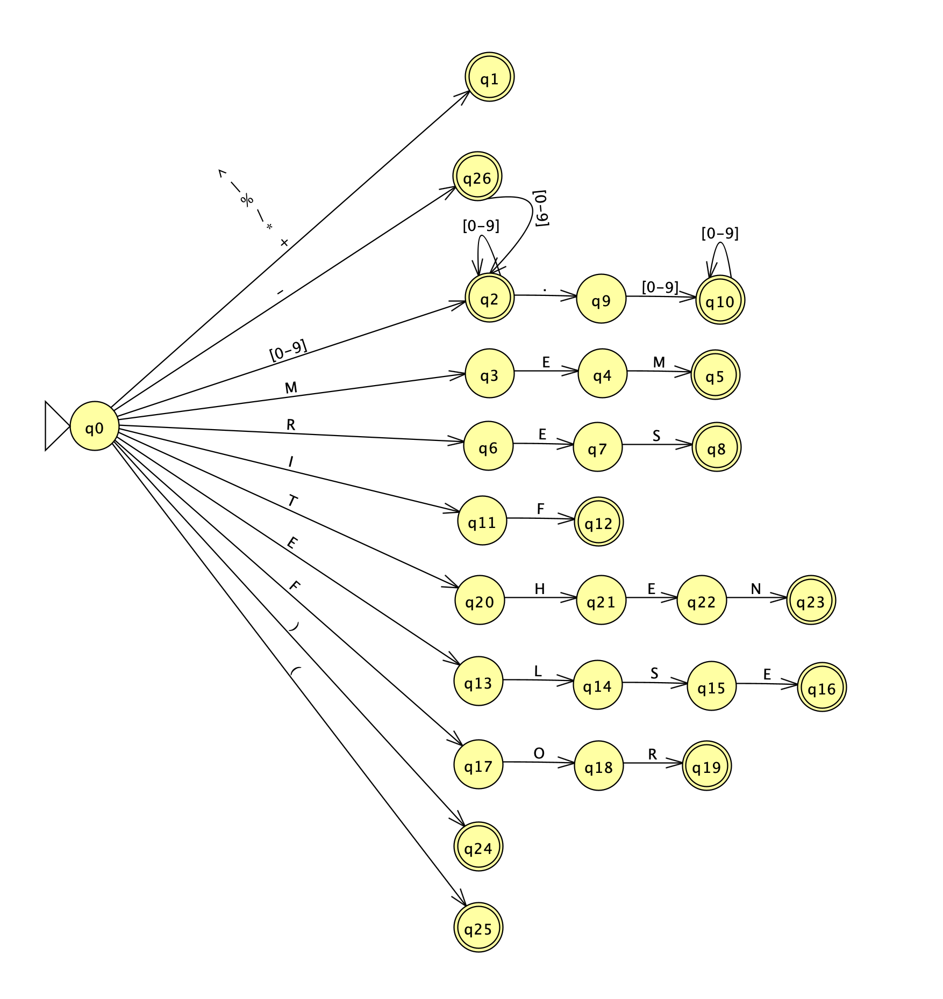

# Analisador Léxico  
Linguagens Formais e Compiladores

Este projeto é um **analisador léxico** implementado em Python, baseado em uma **Máquina de Estados Finitos Determinística (MEFD)**. Ele processa linhas de código e converte lexemas em tokens válidos da linguagem definida.


*MEFD elaborada para fazer a análise léxica dos lexemas da linguagem*  
Utilizado o software [JFALP](https://www.jflap.org/) para desenvolver essa visualização

---

## Visão Geral

O lexer percorre a entrada caractere por caractere e gera uma lista de **tokens** com tipo, valor e posição. Ele reconhece:

- Parênteses: `(` e `)`
- Números inteiros e reais (inclusive negativos): `-10`, `2.5`
- Operadores: `+ - * / % ^ |`
- Palavras-chave: `MEM`, `RES`, `IF`, `THEN`, `ELSE`, `FOR`
- Erros léxicos são capturados e registrados como tokens do tipo `ERROR`, com mensagens descritivas

---

## Estrutura

```markdown
├── Lexer.py            # Lógica do analisador léxico (MEFD)
├── Token.py            # Estrutura do token
├── TokenType.py        # Enum de tipos de token
├── main.py             # Interface de execução
├── mefd.png            # Diagrama da máquina de estados
├── test1.txt           # Arquivo de testes simples
├── test2.txt           # Arquivo de testes intermediário
├── test3.txt           # Arquivo de testes com alguns erros propositais
└── tokens_output.json  # Saída dos tokens (gerado automaticamente)
```
---

## Como Executar

### 1. Pré-requisitos

- Python 3.8+
- Ambiente virtual (recomendado)

### 2. Instalação

```bash
# Crie um ambiente virtual (opcional, mas recomendado)
python -m venv .venv
source .venv/bin/activate  # Linux/Mac
.venv\Scripts\activate     # Windows


```
### 3. Rodar o analisador

- Não há dependências externas, pronto para usar!
- Com o arquivo de entrada (por exemplo, test1.txt): 

```bash
# Roda o arquivo de teste 1
python main.py --file test1.txt --save-json
```

### Isso irá:
-	Tokenizar cada linha do arquivo
-	Exibir os tokens ou erros no terminal
-	Salvar a saída estruturada em tokens_output.json

```json
{
"line": 3,
"tokens": [
{ "value": "abc", "token_class": "ERROR", "row": 3, "column": 1, "error_message": "Unrecognized keyword 'ABC'" },
{ "value": "2", "token_class": "INTEGER_NUMBER", "row": 3, "column": 5 },
{ "value": "+", "token_class": "OPERATOR", "row": 3, "column": 7 }
],
"has_error": true
}
```

## Implementação baseada em MEFD

Cada tipo de token é reconhecido por uma sequência de estados da máquina MEFD (representada no arquivo mefd.png). A lógica do autômato está refletida nas funções do Lexer, como:
-	number(): estados q2 → q9 → q10
-	keyword(): estados q3 → q23
-	Transições por current_char() e advance() simulam os arcos da MEFD

---

## 👨‍💻 Autor

### André Fabricio Wozniack
